## PRODUCTO FINAL : CINCRÍTICA

### Definición:

Antes de seguir con la documentación, es importante conocer la siguiente definición, de la cual nació el nombre del producto

- **Sincretismo** :  Término que se utiliza para definir la conciliación de distintas doctrinas o posturas.

### Planificación:

**Martes 16 de enero**

- LLuvia de ideas.
- Realización de encuestas y su análisis.
- Identificación de la problemática
- Definición del producto
- Definición del número de vistas.
- Definición del flujo del producto.
- Prototipado
- Elección del nombre del producto.

#####Lista de tareas: 

- Aracely Gutarra: Investigación de la API Open Movie Database
- Pamela Rojas: Investigación de la API Open Movie Database
- Brenda Mesías: Investigación de la API de YouTube e investigación de la autenticación con Google.
- Yelitza Cisneros: Elaboración de propuesta de logotipo y paleta de colores.

**Miércoles 17 de Enero**

Yelitza Cisneros: 
- Maquetación y estilos de la vista "Sign up", "Home" y "Splash" (slider). 
- Validación del formulario de registro sin  Google

Aracely Gutarra: 
- Extracción de la data de API Open Movie Database
- Primera maquetación de la vista "Intereses".
- Funcionalidad de la vista "intereses".
- Maquetación inicial de la vista "principal"

Brenda Mesías: 
- Vinculación para el registro de Google mediante Firebase.

Pamela de la Cruz:
- Extracción de la data de API Open Movie Database, para la vista "filters".
- Funcionalidad de la vista "filters"

**Jueves 18 de Enero**

Yelitza Cisneros:
- Maquetación y estilos de la vista "Log In" y guardado de datos del usuario en localStorage.
- Maquetación y estilos de la vista "Intereses".

Brenda Mesías:
- Maquetación y estilo de la vista "principal".
- Guardado del nickname del usuario en localStorage para la vista "principal".

Aracely Gutarra:
- Funcionalidad de la vista "intereses" (filtrado de selección).
- Funcionalidad de la vista "principal".
- Utilización de jQuery Raty | A Star Rating Plugin, para la calificación mediante estrellas del usuario.

Pamela de la Cruz:
- Funcionalidad de la vista "filters", a través del filtrado del API Open Movie Database.
- Utilización de jQuery Raty | A Star Rating Plugin, para la calificación mediante estrellas del usuario.

## User Research

Realizamos dos encuestas virtuales. La primera para conocer las motivaciones, gustos y modos de actuar de los posibles usuarios al momento de ver películas.

### Primera encuesta
Link de la encuesta: 
https://docs.google.com/spreadsheets/d/1GSYrLo6JlDa2eOdUQybpmWgU2rz3L4uCAgXFHdF9cK8/edit?usp=forms_web_b#gid=2038668038

Se realizó a 34 personas y obtuvimos los siguientes resultados:

**Géneros preferidos**
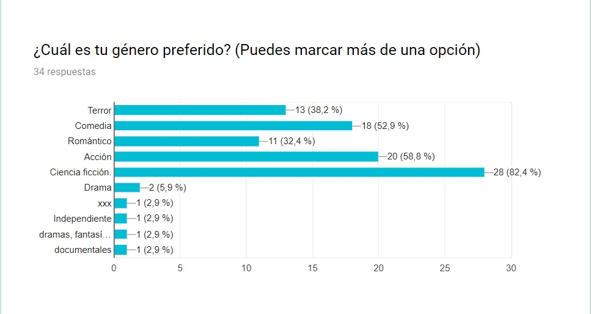

**Frecuencia**
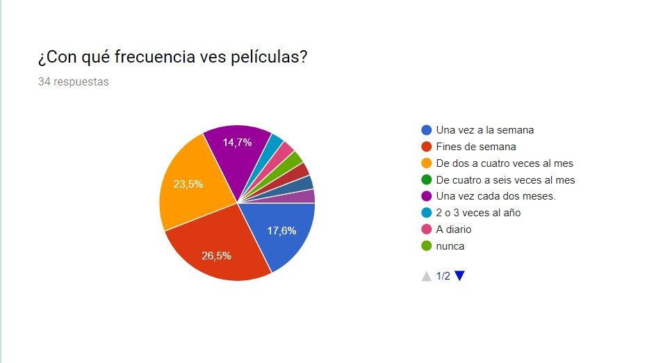

**Decisión**
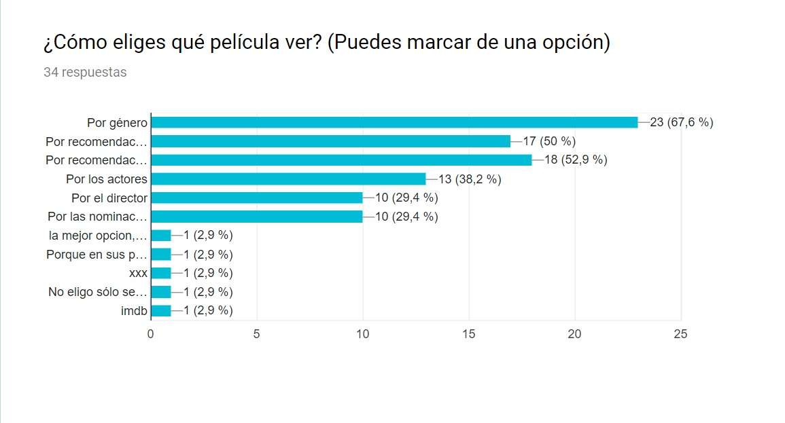

**Opinión**
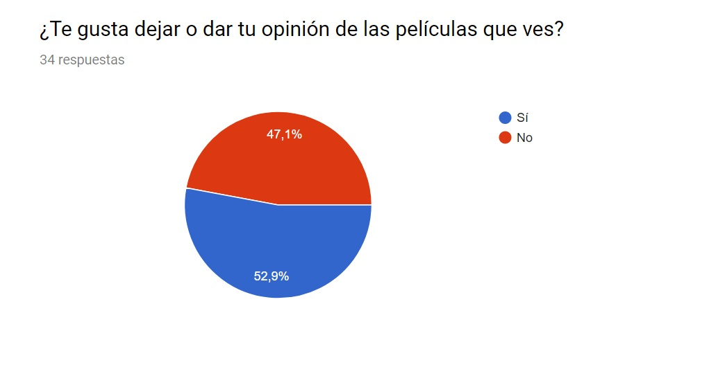

### Segunda encuesta

Link de la encuesta: 
https://docs.google.com/spreadsheets/d/1DlYl4HspP5_HCBH-cPMMcVhUPCSKpHTepqwsviYJgIQ/edit?usp=forms_web_b#gid=12016895

Se realizó a 18 personas, y se centró en sus gustos sobre las críticas de cine. Las respuestas fueron las siguientes.

**Críticas del público**
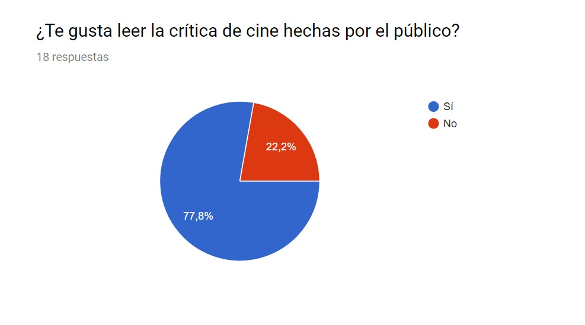

**Críticas del público**
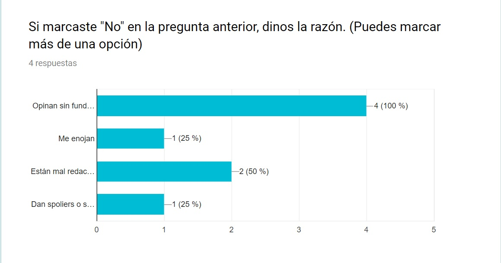

**Escribir Críticas**
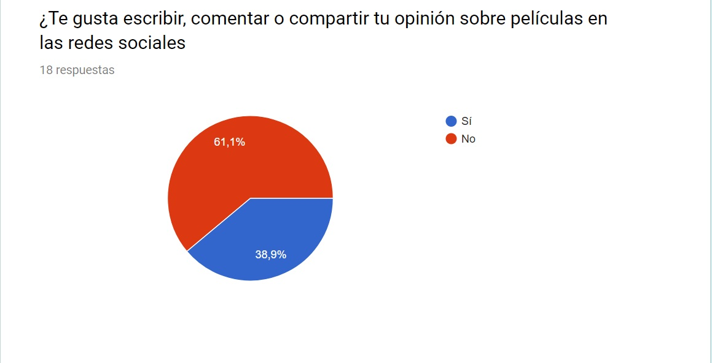

**Escribir Críticas**
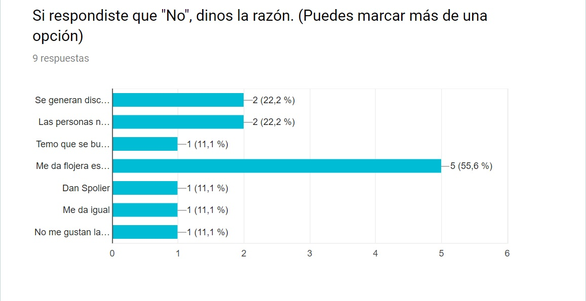

**Recomendaciones**
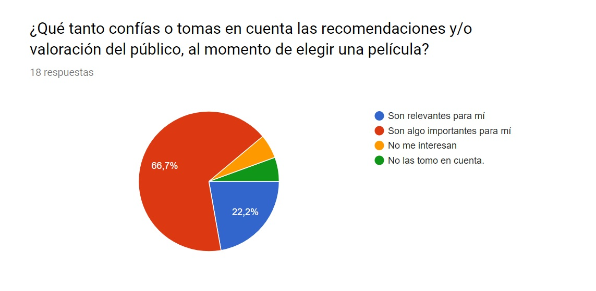

**Calificación**
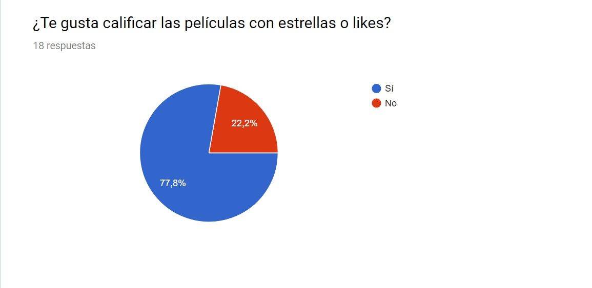

## Arquetipo del usuario:

### Frase de vida:
"Me divierto viendo películas, pero ¿Será buena esa película?"

### Perfil:
Carlos es un joven de 25 años, estudiante universitario. Los fines de semana sale con sus amigos al cine o realizan reunines en su casa para ver películas en alguna página web.
Para decidir que películas, se guía de recomendaciones de amigos, familiares o de páginas web. Sin embargo, muchas veces ha sufrido de spoilers que le quitaron las ganas de ver la película. En otras ocasiones luego de ver una película ha encontrado opiniones contradictorias a las suyas, que acabaron en una pelea. 

### Motivaciones:

- Ver diferentes tipos de películas.
- Divertirse los fines de semana.
- Compartir agradables momentos con sus amigos.

### Metas:
- Culminar sus estudios.
- En unos años, mudarse y vivir solo.

### Frustraciones:
- Está cansado de los spoilers.
- Le molesta que debatan sus opiniones sobre películas.
- Tener que buscar en internet las opiniones de los usuarios.

### Objetivos de Carlos en nuestra plataforma

- Desea dejar de preocuparse por los spoliers
- Contar con la información necesaria para decidir sobre las películas
- Poder opinar sin peleas sobre sus gustos de cine.

### Identificando la Problemática:

Al público no le agrada escribir su opiniones en redes sociales y en la mayoría de las ocasiones tampoco les agrada leerlos. Sin embargo, son de importancia para ellos al momento de elegir una película. 

"Recomendación sin opinión ni spoilers"

## Benchmark : 

### Análisis de la Competencia

- TASTED!VE
Aplicación que recomienda películas que se parecen a otra, filtradas a partir del título.
Tiene la desventaja de que la calificación del público está en base al género y no a la película. Tampoco ofrece un listado de películas para escoger.
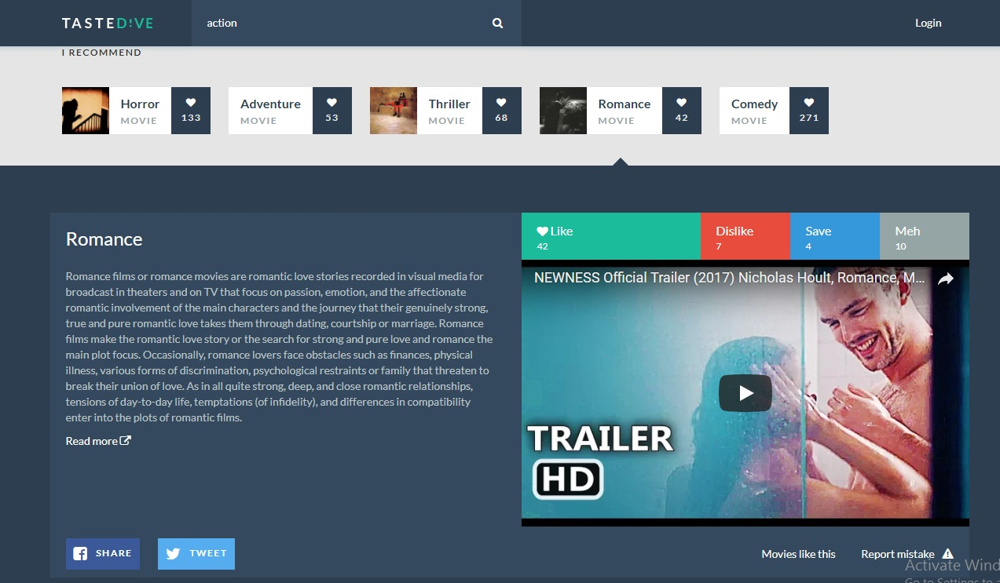

- A Good Movie to Watch: 
 Se enfoca en recomendar películas que no son necesariamente conocidas, pero que cuentan con respaldo de crítica y público. 
 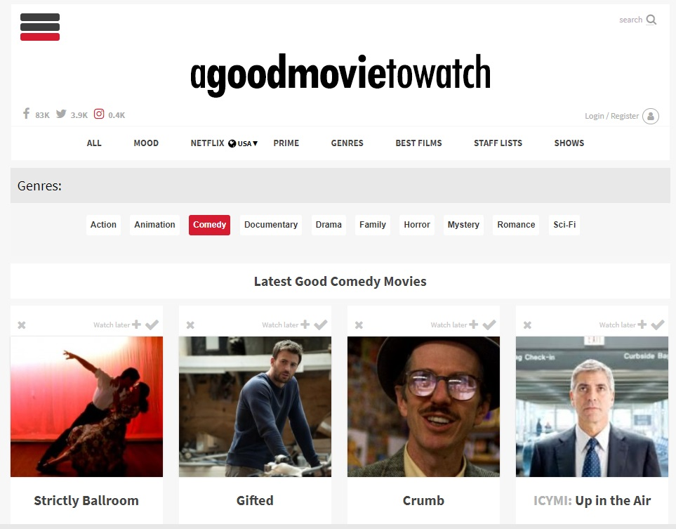

- Good Movies List: 
 Ofrece una lista de las mejores películas de cada año, de acuerdo a si han ganado premios.

 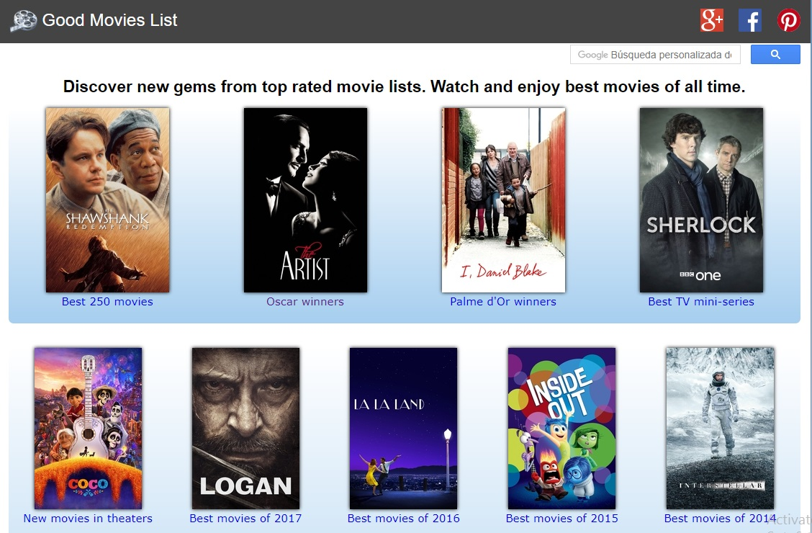

 - Iflix:
 Plataforma que  permite escoger películas, ganadoras o no no de premios. Se pueden ver las películas en streaming o descargándola.
 Ofrece la clasificación dada por el público y por dos críticos especializados. Además de información básica de la pleícula.
 Pero no está disponible en el Perú.

 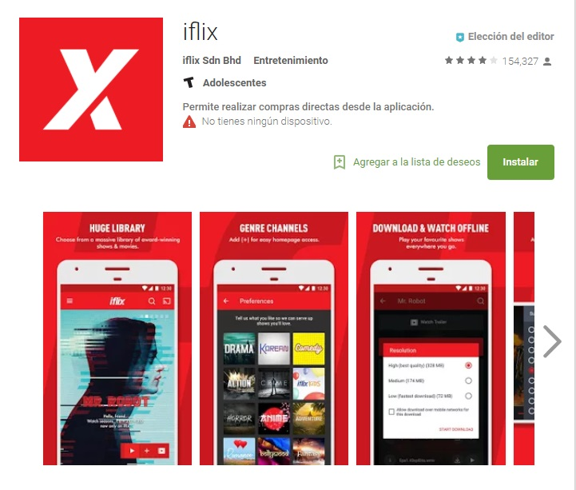

## Propuesta de producto:
Cincrítica es una plataforma virtual donde nuestros usuarios podrán opinar sobre películas en un ambiente libre de conflictos y spoilers, a través de un sistema de calificación y valoración de estrellas. 
Además mostraremos la información necesaria sobre las películas, filtradas de acuerdo a los intereses de cada usuario.

### Flujo de aplicación:

#### 1. Vista Splash: 

Slider de imágenes y textos, que dan una breve explicación al usuario sobre la aplicación.

#### 2. Vista Home: 

Información sobre la aplicación y a través de botones, redirecciona al usuario a registrarse por primera vez o ingresar si ya tiene una cuenta.

#### 3. Vista Sign up:
Formulario de creación de cuenta desde cero. Requiere el llenado de datos personales, un nickname, un correo y una contraseña.
Si la persona se registra con Google, por medio de un modal se le pedirá que ingrese un nickname.

#### 5. Vista Intereses:
Vista donde la persona elige los géneros de películas sobre los que quiere calificar y/o recibir información. El producto le ofrece al usuario elegir entre los siguientes 4 géneros:

- Acción
- Romance
- Ciencia ficción
- Comedia

#### 6. Vista principal:
Una vez que el usuario seleccionó sus géneros preferidos, recibe información de películas basado en el filtrado realizado.

#### 7. Vista filtros:

En la vista principal, hay un botón para acceder al top 10 del género elegido.
Se accederá a otra vista donde se muestra el top 10 de las películas de aquel género. Además el usuario puede calificar las películas de acuerdo a:

- Historia
- Efectos especiales
- Actuación
- Música
- Final

#### Herramientas utilizadas:

1. HTML5
2. CSS3
3. Javascript
4. jQuery
5. Materialize
6. API Open Movie Database
7. Firebase
8. jQuery Raty | A Star Rating Plugin

### **Integrantes**

>##### Yelitza Cisneros
>##### Brenda Mesías 
>##### Araceli Gutarra
>##### Pamela de la Cruz